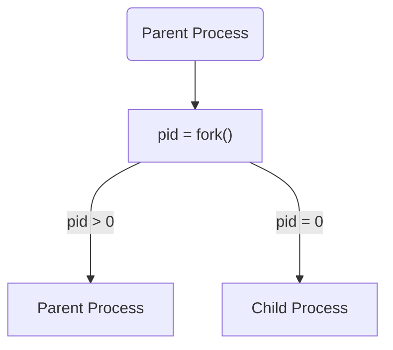

## socket 网络编程
### linux socket 函数
```c
#include <sys/socket.h>


int socket(int domain,int type,int protocol);

int bind(int sockfd, struct sockaddr* myaddr, socklen_t addrlen);

int listen(int sockfd, int backlog);

int accept(int sockfd,struct sockaddr* addr,socklen_t* addrlen);

int connect(int sockfd,struct sockaddr* serv_addr,socklen_t addrlen);

//成功返回0 失败返回-1
```
```
struct sockaddr_in{
  sa_family_t     sin_family;
  uint16          sin_port;
  struct adr_in   sin_addr;  //uint32_t
  char            sin_zero[8];
}

struct sockaddr{
  sa_family_t     sin_family;
  char            sa_data[14];//这里实际需要存储的是sockaddr_in里面sin_port + sin_addr的数据 剩下的字节全部填充0
}
```
//创建socket 随后声明并且初始化地址信息结构体变量
- socket():
  - domian:  协议族信息
    - PF_INET    IPv4协议族
    - PF_INET6   IPv6协议族
    - PF_LOCAL   本地通信的UNIX协议族
    - PF_PACKET  底层套接字的协议族
    - PF_IPX     IPX NoVell协议族
  - type：   数据传输类型
    - SOCK_STREAM  面向连接的套接字
    - SOCK_DGRAM   面向消息的套接字
  - protocol: 计算机间通信中使用的协议信息
    - TCP 0
    - UDP 1
//向套接字分配地址
- bind():
  - sockfd     socket描述符
  - myaddr     需要一个struct sockaddr*的变量一般将sockaddr_in转成sockaddr
  - addrlen    地址长度sockaddr等于sockaddr_in
//进入等待连接请求状态
- listen()
  - sockfd socket描述符,传入需要进入等待连接请求状态的socket描述符以成为服务器端socket
  - backlog  连接请求队列的长度
//受理客户端连接请求
- accept()
  - sockfd  服务器端socket描述符
  - addr    保存发起连接请求的客户端地址信息的变量地址
  - addrlen  第二个参数长度的地址
//客户端的IP、端口在调用connect时自动分配 无需使用bind函数进行分配
-connect()
  - sockfd  客户端套接字描述符
  - servaddr  保存的是目标服务端地址信息的变量地址值
  - addrlen    第二个结构体变量的地址
 
### 常用函数
read()
read函数会尽可能的从socket中获得更多数据  
如果在服务端接收客户端发送的数据时 调用两次read函数 则第二次调用的read并不会获得第一次获得的数据
```
client
write buff = "1234567890"
server
read(socket,buff,3) -> buff = "123"
read(socket,buff,7) -> buff = "4567890"

fread()  
函数会从上一次读取结束的位置开始,读取指定长度的数据,并将文件指针移动到读取结束的位置
如果文件指针已达到文件末尾,他会从文件开头重新读取
fwrite()  

inet_addr()用于将点分十进制IP地址转换成二进制网络字节序IP地址;
inet_ntoa()函数用于二进制网络字节序IP转化点分十进制IP;  

inet_aton()函数用于将点分十进制IP地址转换成二进制网络字节序IP地址;  

inet_ntop()函数用于将二进制网络字节序的地址转换成文本字符串;
inet_pton()函数用于将文本字符串格式转换成二进制网络字节序地址;

htons() htonl()
将主机字节序转为网络字节序
ntohs() ntohl()
将网络字节序转为主机字节序
s和l表示16位数据和32位数据
```

| |0x100|0x101|0x102|0x103|
|-| -  | -  | -  | -  |
|大端 | 0x01 | 0x02 |  0x03| 0x04 |
|小端 | 0x04 | 0x03 |  0x02| 0x01 |

内存从0x100增大 0x100是内存的低地址 0x103是内存的高地址  
大端是内存低地址存储数据最高有效字节  
小端是内存低地址存储数据最低有效字节  
### 常用结构体
```
sockaddr_in{
  sa_family_t sa_family;       //2字节  协议族
  in_port_t sin_port;          //2字节  端口
  struct in_addr sin_addr;     //4字节  IP地址
  sock_in.sin_zero             //8字节0 无实际意义 只为与sockaddr结构体对齐
}
sockaddr{
  sa_family_t sa_family;       //2字节  协议族
  char sa_data[14];            //14字节  端口和IPV4/6数据 和填充的0
}
in_addr{
  in_addr_t s_addr;            //4字节  IP地址
}
hostent{
  char *h_name;                //官方域名
  char **h_aliases;            //其他域名 可能多个
  int h_addrtype;              //地址族信息 AF_INET/AF_INET6
  int h_length;                //IP地址长度 V4 4字节 V6 16字节
  char **h_addr_list;          //保存域名对应的IP地址信息 可能多个
}
```
### TCP
TCP套接字中的I/O缓冲  
在创建套接字时 操作系统会分配发送缓冲和接收缓冲  
当send时 数据被复制到发送缓冲 直到操作系统决定将其发送到目标套接字的接收缓冲中
当数据被传输到套接字时 首先会被存储在接受缓冲中 并等到城市调用recv来读取
TCP中的服务端套接字指的是accept()函数接受来自客户端的连接请求时 操作系统为每个客户端创建的新套接字
bind()函数用来绑定socket与地址信息
TCP客户端套接字在调用connect函数时自动分配IP地址和端口(随机)
### 优雅的断开套接字连接
linux的close和windows的closesocket函数意味着完全断开连接--无法传输数据、无法接受数据  
基于TCP的半关闭  
```
int shutown(int socket,int howto)
SHUT_RD  断开输入
SHUT_WR  断开输出
SHUT_RDWR  同时断开输入输出
```
### UDP
UDP客户端套接字可以调用bind函数绑定IP地址和端口也可以等sendto的时候自动分配IP地址和端口(随机)
UDP套接字存在数据边界 一端sendto了多少次 一端就要recvfrom多少次 
UDP一个数据包即可算是一个完整数据 也称数据报
### 套接字的多种可选项
IPPROTO_IP    IP协议相关
IPPROTO_TCP   TCP协议相关
- SOL_SOCKET    套接字通用相关  
  - SO_SNDBUF  发送缓冲区大小  
  - SO_RCVBUF  接收缓冲区大小  
  - SO_REUSEADDR 和 Time-wait

发生地址分配错误
先断开连接(FIN消息)的套接字在经过四次握手过程后并非立即消除  
而是需要经过一段时间的Time-wait状态 若是服务端先断开连接 进入  
Time-wait状态 其相应端口是正在使用的状态 从无法立即重新运行  
更改SO_REUSEADDR状态为1 可将Time-wait状态下的套接字端口号  
重新分配给新的套接字
#### TCP_NODELAY
Nagle算法
最大程度缓冲数据 只有收到前一数据的ack消息时 才发送下一数据  
传输大文件数据时 禁用Nagle算法  
```
IPPROT_TCP    TCP_NODELAY = 1 则禁用
```

### TCP协议
#### 三次握手
客户端首先向服务端发送数据包 表明想建立连接 并随机产生一个seq number  
\[1\]flag:SYN = 1;seq = x  
服务端收到客户端建立连接的请求 发送确认信息 并随机产生一个seq number  
\[2\]flag:SYN = 1,ACK = 1; ack = x+1 ,seq = y  
客户端收到确认信息 回复服务端  
\[3\]flag:ACK = 1; ack = y+1 ,seq = x+1  
seq = x表示有效数据从编号x开始  
ack = y表示已收到发送方<y的数据 并期望发送方下次发送的数据seq从y开始  
建立连接时 客户端和服务端都会产生一个随机的seq指 且单独ACK报文如果不携带数据 seq不增加 其他情况增加  

|/|1|2|3|4|5|6|7|8|9|10|
|-|-|-|-|-|-|-|-|-|-|-|
|**客户端**|SYN=1<br>seq=0||ACK=1<br>seq=1<br>ack=1|PSH=1<br>ACK=1<br>seq=1<br>ack=1<br>len=10|||ACK=1<br>seq=11<br>ack=11|FIN=1<br>ACK=1<br>seq=11<br>ack=11||ACK=1<br>seq=12<br>ack=12|
|**数据流**|建立连接?|建立|确认建立|发送数据|确认数据|发送数据|确认数据|关闭连接|关闭连接|确认关闭|
|**服务端**||SYN=1<br>ACK=1<br>seq=0<br>ack=1|||ACK=1<br>seq=1<br>ack=11|PSH=1<br>ACK=1<br>seq=1<br>ack=11<br>len=10|||FIN=1<br>ACK=1<br>seq=11<br>ack=12<br>||

### 设置socket
```
getsockopt(int sockrt,int level,int optname,void* optval,socklen_t* optlen)  
- sock        查看选项套接字的描述符  
- level       查看可选项的协议层  
- optname     要查看的可选项名  
- optval      保存查看结果的缓冲区地址  
- optlen      缓冲区的大小 调用函数后该参数中保存通过第四个参数返回的可选项信息的字节数  
读取套接字可选项  
setsockopt(int sockrt,int level,int optname,const void* optval,socklen_t* optlen)  
- sock        更改可选项套接字的描述符  
- level       要更改的协议层  
- optname     保存的可选项名  
- optval      保存要更改的选项信息的缓冲区地址  
- optlen      向第四个参数传递的可选项信息的字节数
```
### windows socket 函数
```c
WSADATA wsaData;
WSAStartup(MAKEWORD(2, 2), &wsaData);

SOCKET ListenSocket;
ListenSocket = socket(AF_INET, SOCK_STREAM, IPPROTO_TCP);

sockaddr_in service;
service.sin_family = AF_INET;
service.sin_port = htons(27015);
inet_pton(AF_INET, "127.0.0.1", &service.sin_addr);

bind(ListenSocket,(SOCKADDR *) & service, sizeof (service)
//将本地地址与套接字关联

listen(ListenSocket, 1)
//将套接字置于侦听传入连接的状态

SOCKET AcceptSocket;
AcceptSocket = accept(ListenSocket, NULL, NULL);
//允许套接字尝试传入连接

closesocket(ListenSocket);

WSACleanup();
```
### 多进程服务器端
#### 并发服务器的实现方法
```
int fork(void)
Clone the calling process, creating an exact copy.
Return -1 for errors, 0 to the new process,
and the process ID of the new process to the old process.
```

##### 多进程服务器
**创建进程**  
使用fork创建进程 父进程返回子进程PID 子进程返回0  
**僵尸进程**  
如果子进程比父进程执行的时间更短 且父进程没有处理子进程`exit`或者`return`返回的退出信号 就会产生僵尸程序  
**销毁僵尸进程**  
```
pid_t wait(int *status)
//阻塞进程 直到有一个终止的子进程出现 并且销毁
pid_t waitpid(pid_t pid,int *status,int options)
//pid>0时 只等待进程ID等于pid的子进程 不管其它已经有多少子进程运行结束退出了 只要指定的子进程还没有结束 waitpid就会一直等下去
//pid=-1时 等待任何一个子进程退出 没有任何限制 此时waitpid和wait的作用一模一样
//pid=0时 等待同一个进程组中的任何子进程 如果子进程已经加入了别的进程组 waitpid不会对它做任何理睬
//pid<-1时 等待一个指定进程组中的任何子进程 这个进程组的ID等于pid的绝对值
//options: options提供了一些额外的选项来控制waitpid 目前在Linux中只支持WNOHANG和WUNTRACED
//如果使用了WNOHANG参数调用waitpid 即使没有子进程退出 它也会立即返回 不会像wait那样永远等下去

waitpid支持作业控制(以WUNTRACED选项). 用于检查wait和waitpid两个函数返回终止状态的宏: 这两个函数返回的子进程状态都保存在status指针中, 用以下3个宏可以检查该状态: 

WIFEXITED(status): 若为正常终止, 则为真. 此时可执行 WEXITSTATUS(status): 取子进程传送给exit或_exit参数的低8位
WIFSIGNALED(status): 若为异常终止, 则为真.此时可执行 WTERMSIG(status): 取使子进程终止的信号编号 
WIFSTOPPED(status): 若为当前暂停子进程, 则为真. 此时可执行 WSTOPSIG(status): 取使子进程暂停的信号编号

```
因为操作系统并不会主动传递子进程退出的信号 需要父进程主动处理使用`wait`或者`waitpid`函数避免产生僵尸进程  
可以多次调用wait处理程序产生的多个子进程  
调用wait时 如果没用已终止的子进程 程序会阻塞  
调用waitpid()函数 此函数不会阻塞  
##### 信号处理
```
void (*signal(int signo,void(*func)(int)))(int)
//signo 信号
//void函数指针

int sigaction (int sig, const struct sigaction* act,struct sigaction* oact)
//
struct sigaction{
  void (*sa_handler)(int);
  sigset_t sa_mask;
  int sa_flags;
}

SIGALRM  到达alarm函数注册的时间
SIGINT   键盘键入CTRL+C
SIGCHLD  子进程终止  

unsigned int alarm(unsigned int seconds)
//对应seconds秒后 产生一个SIGALRM 信号 若对该函数传递0 则之前对SIGALRM信号的预约取消
//如果预约信号但是未处理 会通过signal终止进程
```
signal函数 实际是一个回调函数 回调函数的作用是在某个特定时间产生的时候 执行相应的操作  
如果同时产生多个SIGCHLD信号时 其他信号可能会丢失 导致产生僵尸进程
##### 基于多任务的并发服务器
调用fork函数后 父进程和子进程同时拥有两个socket描述符 服务端listen socket 和accept返回的与客户端连接的socket  
需要close掉父子进程不需要的描述符  
父进程保留服务端listen socket  
子进程保留accept返回的与客户端连接的socket  
##### 分割TCP的I/O程序

##### 多路复用服务器
##### 多线程服务器

